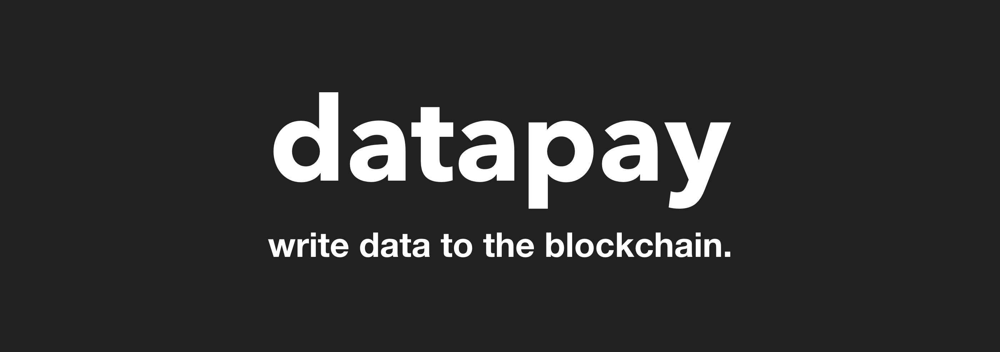
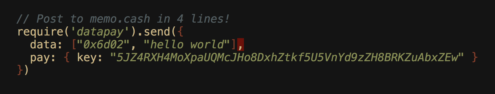

# Datapay

Datapay is the simplest library for building and broadcasting data transactions to the **Bitcoin SV blockchain**.



---

# Preview

Post to the blockchain with just 4 lines of code. 



---

# Demo

## 1. Datapay Transaction Composer

- [Datapay transaction composer](https://unwriter.github.io/datapay/example/composer)

- [View source](example/composer.html)

## 2. Microblogging Playground

Post to both Memo.cash and Blockpress with a single interface.

- [DEMO](https://unwriter.github.io/datapay/example/playground)

- [View source](example/playground.html)

---


# Install

## 1. In node.js

```
npm install --save datapay
```

Also install `bsv` (Datapay has a peer dependency on bsv).

```
npm install --save bsv
```

and then require it

```
const datapay = require('datapay')
```

## 2. In browser

```
<script src='https://unpkg.com/datapay@0.0.15/dist/datapay.min.js'></script>
```

---

# Quickstart

Send `"Hello from datapay"` to [memo.cash](https://memo.cash) in 5 lines of code.


```
const privateKey = [YOUR PRIVATE KEY HERE];
datapay.send({
  data: ["0x6d02", "Hello from datapay"],
  pay: { key: privateKey }
});
```

Above code builds an `OP_RETURN` transaction with `0x6d02 hello` as push data, and broadcasts it to Bitcoin SV network.

---

# Declarative Programming

Datapay lets you build a transaction in a declarative manner. Here's an example:

```
var config = {
  data: ["0x6d02", "hello from datapay"],
  pay: {
    key: "5JZ4RXH4MoXpaUQMcJHo8DxhZtkf5U5VnYd9zZH8BRKZuAbxZEw",
    rpc: "https://api.bitindex.network",
    fee: 400,
    to: [{
      address: "1A2JN4JAUoKCQ5kA4pHhu4qCqma8jZSU81",
      value: 1000
    }]
  }
}
```

Above config describes a transaction that:

- Posts `"hello from datapay"` to [memo.cash](https://memo.cash) network (See the protocol at [https://memo.cash/protocol](https://memo.cash/protocol)),
- paying the fee of `400` satoshis,
- signed with a private key: `5JZ4RXH4MoXpaUQMcJHo8DxhZtkf5U5VnYd9zZH8BRKZuAbxZEw`,
- through a public JSON-RPC endpoint at [https://api.bitindex.network](https://api.bitindex.network)
- while tipping the user `1A2JN4JAUoKCQ5kA4pHhu4qCqma8jZSU81` a value of `1000` satoshis.

All you need to do to invoke it is call:

```
datapay.send(config)
```

Want to instead build a transaction but save it for later or export it? Just call:

```
datapay.build(config, function(error, tx) {
  console.log("Here's the transaction! : ", tx)
})
```

And that's it! No complex APIs, but you can construct pretty much all kinds of OP_RETURN transactions.

---

# How it works

`datapay` is powered by [bsv](https://github.com/moneybutton/bsv), which in turn is a fork of [bitcore-lib](https://github.com/bitpay/bitcore-lib), which means all the low level transactions are completely robust and secure, since they're being used in production at companies like:

- [Moneybutton](https://moneybutton.com)
- [Bitpay](https://bitpay.com)
- and more

`datapay` was created in order to make it dead simple to construct `OP_RETURN` related transactions, but you can even use it to build regular transactions.

Also `datapay` exposes `datapay.bsv` endpoint which you can use to access the underlying `bsv` library. If you need more sophisticated features (in most cases you won't), feel free to use this feature. Best of both worlds!

---

# API

Datapay is designed with a different philosophy than conventional Bitcoin transaction libraries.

While **traditional Bitcoin libraries focus on sending money**, datapay is focused on **sending data**.

The API is optimized to make this as simple as possible. Datapay library has only two methods:

1. `build`: For building a transaction (but not sending)
2. `send`: For sending a transaction

## 1. build

"build" builds a transaction but doesn't broadcast it to the network.

The `build()` method takes two arguments:

1. A JSON object describing the type of transaction
2. **A callback function that will be called after building the transaction:** The callback function has two arguments. The first is an error object if something fails. The second is the constructed transaction.

The first argument--a declarative JSON object--can contain the following attributes:

- `data`: For constructing `OP_RETURN` data
- `pay`: For describing everything related to actually sending money
- `tx`: For importing previously "built" transactions


### A. data

The `data` attribute is used to construct human readable/processable data to post to the blockchain.


#### 1. Buid from push data array


```
const tx = {
  data: ["0x6d02", "hello world"]
}
datapay.build(tx, function(err, tx) {  
  /**
  * res contains the generated transaction object, powered by bsv
  * You can check it out at https://github.com/moneybutton/bsv/blob/master/lib/transaction/transaction.js
  * Some available methods you can call on the tx object are:
  * 1. tx.toString() => Export as string
  * 2. tx.toObject() => Inspect the transaction as JSON object
  **/
});
```

**NOTE:** Each item in the `data` array can either be:

1. a regular string
2. a hex string
3. Binary data ([Buffer](https://nodejs.org/api/buffer.html) in node.js, and [ArrayBuffer](https://developer.mozilla.org/en-US/docs/Web/JavaScript/Reference/Global_Objects/ArrayBuffer) in browser)

**To use hex string, simply prefix the string with "0x"**. 

**To use Buffer types, just pass the Buffer (or ArrayBuffer) object as push data.**

**To use an opcode, pass an object `{op: [OPCODE]}`** (You can see the OPCODE list [here](https://github.com/moneybutton/bsv/blob/master/lib/opcode.js#L78))

In above example, we can see that the first item is `"0x6d02"`. Datapay will automatically recognize this as a hex string and interpret as a hex string (while discarding the 0x prefix before the interpretation)


#### 2. Build from Binary Data + String

In Node.js (Buffer)

```
const tx = {
  data: ["0x6d02", Buffer.from("Abc"), "hello world"]
}
datapay.build(tx, function(err, tx) {  
  /**
  * res contains the generated transaction object, powered by bsv
  * You can check it out at https://github.com/moneybutton/bsv/blob/master/lib/transaction/transaction.js
  * Some available methods you can call on the tx object are:
  * 1. tx.toString() => Export as string
  * 2. tx.toObject() => Inspect the transaction as JSON object
  **/
});
```

In Browser, building OP_RETURN from `input[type=file]` (ArrayBuffer)

```
document.querySelector("input[type=file]").onchange = function(e) {
  // get file type
  var filetype = e.target.files[0].type
  var reader = new FileReader();
  // Listen to file load event (Will call the actual load below)
  reader.addEventListener('load', function(event) {
    // ArrayBuffer
    var ab = event.target.result
    datapay.build({
      data: [ "19HxigV4QyBv3tHpQVcUEQyq1pzZVdoAut", ab, filetype ]
    }, function(err, res) {
      console.log("built transaction = ", res)
    })
  })
  // Read file content as "ArrayBuffer"
  reader.readAsArrayBuffer(e.target.files[0]);
}
```

#### 3. Build from hex string representing the script

This is useful if you want to export a transaction and later recover it.

```
const tx = {
  data: "6a04366430320b68656c6c6f20776f726c64"
}
datapay.build(tx, function(err, tx) {
  /**
  * res contains the generated transaction object, powered by bsv
  * You can check it out at https://github.com/moneybutton/bsv/blob/master/lib/transaction/transaction.js
  * Some available methods you can call on the tx object are:
  * 1. tx.toString() => Export as string
  * 2. tx.toObject() => Inspect the transaction as JSON object
  **/
});
```

---

### B. pay

The `pay` attribute deals with everything related to actually sending money.

- `key`: Signing with private key
- `rpc`: Specifying a JSON-RPC endpoint to broadcast through
- `fee`: Specifying transaction fee
- `feeb`: Specifying transaction fee per byte
- `to`: Attaching tips on top of OP_RETURN messages (Normally OP_RETURN transactions don't have a receiver)

When a `pay` attribute is present, the `build()` call generates a `transaction` instead of a `script`.

#### 1. `key`

The `key` attribute is mandatory. You must specify a private key in order to sign a transaction.

```
const tx = {
  data: ["0x6d02", "hello world"],
  pay: { key: "5JZ4RXH4MoXpaUQMcJHo8DxhZtkf5U5VnYd9zZH8BRKZuAbxZEw" }
}
datapay.build(tx, function(err, tx) {
  /**
  * res contains the generated transaction object
  * (a signed transaction, since 'key' is included)
  **/
})
```


#### 2. `rpc`

The `rpc` attribute is used to manually set the JSON-RPC endpoint you wish to broadcast through. 

- default: `https://api.bitindex.network`

```
const tx = {
  data: ["0x6d02", "hello world"],
  pay: {
    key: "5JZ4RXH4MoXpaUQMcJHo8DxhZtkf5U5VnYd9zZH8BRKZuAbxZEw",
    rpc: "https://api.bitindex.network"
  }
};
datapay.build(tx, function(err, res) {
  /**
  * res contains the generated transaction object
  * (a signed transaction, since 'key' is included)
  **/
})
```

#### 3a. `fee`

The `fee` attribute is used to specify the transaction fee in **satoshis**.

- default: `400`

```
const tx = {
  data: ["0x6d02", "hello world"],
  pay: {
    key: "5JZ4RXH4MoXpaUQMcJHo8DxhZtkf5U5VnYd9zZH8BRKZuAbxZEw",
    rpc: "https://api.bitindex.network",
    fee: 400
  }
}
datapay.build(tx, function(err, res) {
  /**
  * res contains the generated transaction object
  * (a signed transaction, since 'key' is included)
  **/
})
```

#### 3b. `feeb`

The `feeb` attribute is used to specify the transaction fee per byte in **satoshis**.

- default: `1.04`

```
const tx = {
  data: ["0x6d02", "hello world"],
  pay: {
    key: "5JZ4RXH4MoXpaUQMcJHo8DxhZtkf5U5VnYd9zZH8BRKZuAbxZEw",
    rpc: "https://api.bitindex.network",
    feeb: 1.04
  }
}
datapay.build(tx, function(err, res) {
  /**
  * res contains the generated transaction object
  * (a signed transaction, since 'key' is included)
  **/
})
```

#### 4. `to`

The `to` attribute is an array of receivers to send the OP_RETURN to. Normally this is left empty because most `OP_RETURN` transactions are meant to have no receivers. But you can also send it to multiple users. For example you can use this feature to send tips to one or more people.

- default: `null`
- Each item in the `to` array can have 2 attributes:
  - address: Bitcoin SV address string
  - value: number (in satoshi)

```
const tx = {
  data: ["0x6d02", "hello world"],
  pay: {
    key: "5JZ4RXH4MoXpaUQMcJHo8DxhZtkf5U5VnYd9zZH8BRKZuAbxZEw",
    to: [{
      address: "1A2JN4JAUoKCQ5kA4pHhu4qCqma8jZSU81",
      value: 500
    }, {
      address: "1A2JN4JAUoKCQ5kA4pHhu4qCqma8jZSU81",
      value: 500
    }]
  }
};
datapay.build(tx, function(err, res) {
  /**
  * res contains the generated transaction object
  * (a signed transaction, since 'key' is included.
  * Also, the transaction includes actual coin transfer outputs,
  * since the "to" attribute is included)
  **/
})
```

#### 5. `filter`

By default, datapay uses ALL existing UTXOs associated with an address.

But sometimes you want more fine-grained control over which UTXOs to use for a transaction. For example, it is critical for UTXO-based token protocols like SLP (Simple Ledger Protocol) to make sure that a UTXO containing an SLP token transaction is ONLY used for SLP transactions. (Otherwise your token is lost)

For this feature, datapay uses [Bitquery](https://docs.bitdb.network/docs/query_v3) as a filter to describe the UTXOs to filter out.


```
const tx = {
  data: ["0x6d02", "hello world"],
  pay: {
    key: "5JZ4RXH4MoXpaUQMcJHo8DxhZtkf5U5VnYd9zZH8BRKZuAbxZEw",
    filter: {
      v: 3,
      q: {
        find: {
          "out.b0": { "op": 106 },
          "out.s1": "SLP"
        }
      }
    }
  }
}
datapay.build(tx, function(err, tx) {
  /**
  * res contains the generated transaction object
  * (a signed transaction, since 'key' is included)
  **/
})
```

---

### C. tx

You may want to import a previously exported transaction. This is when you use the `tx` attribute.

#### 1. Importing a transaction from exported hex string

```
datapay.build({
  tx: "01000000014182e9844c2979d973d3e82c55d57e1a971ed2e5473557ce0414864612911aa5010000006b48304502210098f8f32cd532bc73eef1e01c3d359caf0a7aa8f3dc1eebb8011d80810c9dbe66022054c6b23d5bd9573a1e6135c39dcc31a65cab91f3b3db781995e824614e24bad9412102d024c1861ccc655ce3395bc4d8a0bdcfb929ffcd9d1a8c81d8c6fa1dfb9bd70cffffffff020000000000000000106a026d020b68656c6c6f20776f726c64c2ff0000000000001976a9142a3a6886d98776d0197611e5328ba8806c3739db88ac00000000"
}, function(err, tx) {
  // 'tx' is a transaction object
})
```

#### 2. Importing an unsigned transaction and building a signed transaction

You can export an unsigned transaction, and later import and sign it to create a signed transaction, simply by supporting a `pay.key` attribute.

```
// import an unsigned transaction and sign it
datapay.build({
  tx: "01000000014182e9844c2979d973d3e82c55d57e1a971ed2e5473557ce0414864612911aa5010000006b48304502210098f8f32cd532bc73eef1e01c3d359caf0a7aa8f3dc1eebb8011d80810c9dbe66022054c6b23d5bd9573a1e6135c39dcc31a65cab91f3b3db781995e824614e24bad9412102d024c1861ccc655ce3395bc4d8a0bdcfb929ffcd9d1a8c81d8c6fa1dfb9bd70cffffffff020000000000000000106a026d020b68656c6c6f20776f726c64c2ff0000000000001976a9142a3a6886d98776d0197611e5328ba8806c3739db88ac00000000",
  pay: {
    key: "5JZ4RXH4MoXpaUQMcJHo8DxhZtkf5U5VnYd9zZH8BRKZuAbxZEw"
  }
}, function(err, tx) {
  // 'tx' is a signed transaction object
})
```

Notice how in addition to the `tx` attribute we've added the `pay.key` attribute. This will import the unsigned transaction and sign it.


#### 3. Importing and sending a signed transaction from exported hex string

If you already have a signed transaction object, you can simply send it away without any additional steps.

```
datapay.send({
  tx: "01000000014182e9844c2979d973d3e82c55d57e1a971ed2e5473557ce0414864612911aa5010000006b48304502210098f8f32cd532bc73eef1e01c3d359caf0a7aa8f3dc1eebb8011d80810c9dbe66022054c6b23d5bd9573a1e6135c39dcc31a65cab91f3b3db781995e824614e24bad9412102d024c1861ccc655ce3395bc4d8a0bdcfb929ffcd9d1a8c81d8c6fa1dfb9bd70cffffffff020000000000000000106a026d020b68656c6c6f20776f726c64c2ff0000000000001976a9142a3a6886d98776d0197611e5328ba8806c3739db88ac00000000"
}, function(err, hash) {
  // 'hash' is the transaction hash
})
```

---

## 2. send

Instead of just building, you can build AND send. Same syntax as `build()`.

The only difference is the callback function.

- build() returns a constructed transaction object through the callback
- send() returns a transaction hash (since it's already been sent)

### A. Sending from data and pay

```
const tx = {
  data: ["0x6d02", "hello world"])
  pay: { key: "5JZ4RXH4MoXpaUQMcJHo8DxhZtkf5U5VnYd9zZH8BRKZuAbxZEw" }
}
datapay.send(tx, function(err, res) {
  console.log(res)
})
```

### B. Building an UNSIGNED transaction and exporting, and then later importing and sending the transaction in separate steps

```
// Build and export an unsigned transaction for later usage
var exportedTxHex = "";
const tx = {
  data: ["0x6d02", "hello world"]
}
datapay.build(tx, function(err, res) {
  exportedTxHex = res;
})

// Later import exportedTxHex and sign it with privatkey, and broadcast, all in one method:
datapay.send({
  tx: exportedTx,
  pay: { key: "5JZ4RXH4MoXpaUQMcJHo8DxhZtkf5U5VnYd9zZH8BRKZuAbxZEw" }
}, function(err, hash) {
  // hash contains the transaction hash after the broadcast
})
```

### C. Building a SIGNED transaction and exporting, and then later importing and sending

This time since the exported transaction is already signed, no need for additional `pay.key` attriute when sending later


```
// Build and export an unsigned transaction for later usage
var exportedSignedTxHex = "";
const tx = {
  data: ["0x6d02", "hello world"],
  pay: { key: "5JZ4RXH4MoXpaUQMcJHo8DxhZtkf5U5VnYd9zZH8BRKZuAbxZEw" }
}
datapay.build(tx, function(err, res) {
  exportedSignedTxHex = res;
})

// Later import exportedTxHex and broadcast, all in one method:
datapay.send({
  tx: exportedSignedTx,
}, function(err, hash) {
  // hash contains the transaction hash after the broadcast
})
```

---

# Advanced

Datapay depends on two powerful libraries for low level stuff.

1. bsv: https://github.com/moneybutton/bsv
2. bitcore-explorers: https://github.com/bitpay/bitcore-explorers

While Datapay is designed to be the simplest possible way to write data to the blockchain, you may want to sometimes access the low level libraries that power datapay.

Datapay exposes additional endpoints so you can simply access these libraries without having to install or include any additional libraries.

## 1. datapay.bsv

This endpoint exposes the [bsv](https://github.com/moneybutton/bsv) library object. Basically by referncing `bsv` you have access to the entire bsv library.

```
const privateKey = new datapay.bsv.PrivateKey();
const address = privateKey.toAddress();
console.log(address.toString()) // 15WZwpw3BofscM2u43ji85BXucai5YGToL
```

## 2. datapay.connect

This endpoint is used to access the [bitcore-explorers](https://github.com/bitpay/bitcore-explorers) library.

Using this endpoint you can connect to a public JSON-RPC endpoint to let you make various direct JSON-RPC function calls such as `getUnspentUtxos`, etc. (Basically it instantiates and returns the `insight` object from https://github.com/bitpay/bitcore-explorers)

### Syntax

```
datapay.connect([RPC ENDPOINT]).[METHOD]
```

If you leave the `RPC ENDPOINT` part out, it will automatically use the default https://api.bitindex.network node

### Example 1: Connecting to default node and calling `getUnspentUtxos()` method:

```
datapay.connect().getUnspentUtxos("14xMz8rKm4L83RuZdmsHXD2jvENZbv72vR", function(err, utxos) {
  if (err) {
    console.log("Error: ", err)
  } else {
    console.log(utxos) 
  }
})
```

### Example 2. Specifying a JSON-RPC endpoint

```
datapay.connect('https://api.bitindex.network').getUnspentUtxos("14xMz8rKm4L83RuZdmsHXD2jvENZbv72vR", function(err, utxos) {
  if (err) {
    console.log("Error: ", err)
  } else {
    console.log(utxos) 
  }
});
```
